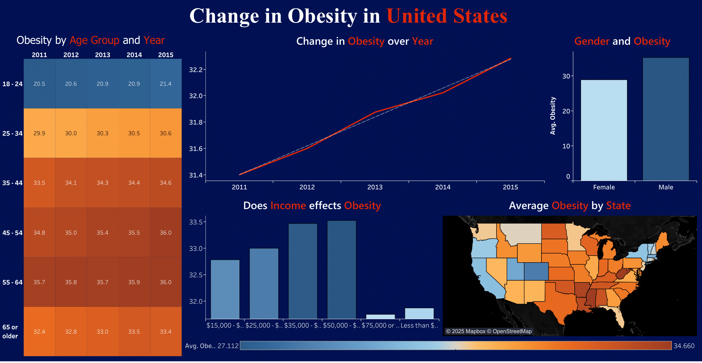

# 📊 Public Health Dashboard (Tableau)

This repository showcases a Tableau dashboard analyzing public health indicators across U.S. states using the **CDC NPAO (Nutrition, Physical Activity, and Obesity)** dataset, with a focus on trends related to the COVID-19 pandemic period.

---

## 📂 Repository Structure

```
📁 tableau-covid-dashboard/
├── Tableau Workbook.twbx            # Tableau packaged workbook with data
├── dashboard_preview.png            # Screenshot of the Tableau dashboard
├── README.md                        # Project overview and usage instructions
└── report.md                        # Analytical report and findings
```

---

## 🧠 Project Goals

- Identify health behavior disparities (e.g., obesity, inactivity) across states
- Visualize time-based trends pre/post COVID-19
- Provide interactive tools for stakeholders to explore the data

---

## 🗃️ Data Description

- **Source:** U.S. Centers for Disease Control and Prevention (CDC)
- **Dataset File:** `cdc_npao.csv`
- **Variables:**  
  - State, Year, Indicator Type (Obesity, Inactivity, etc.), Data Value, Demographics

---

## 🔧 Tools & Technologies

- **Tableau Desktop** – Data visualization and dashboard development
- **CSV File Format** – Raw health data
- **GitHub** – Project versioning and documentation

---

## 🖥️ Dashboard Features

- 📍 **Geographic Heatmaps** – State-wise comparison  
- 📈 **Time Series Trends** – Obesity patterns over years  
- 👥 **Demographic Segmentation** – By age, gender, and income  
- 🎚️ **Interactive Filters** – Year, state, and indicator-based exploration  
- 💬 **Hover Tooltips** – Data-rich insights on mouse-over

---

## 📷 Dashboard Preview



---

## 🚀 How to Run the Project

1. Clone or download the repository
2. Open `Tableau Workbook.twbx` in **Tableau Desktop**
3. Interact with filters and charts to explore health trends

---

## 📚 License

This project is provided for educational and research purposes. Please credit the original dataset from CDC if reused.

---

## 🙋‍♂️ Author

**Obai Ahmed**  
📧 obaialid45@gmail.com  
🔗 [LinkedIn](https://www.linkedin.com/in/obai-ahmed-b7697433a/)  
🔗 [GitHub](https://github.com/SoObai)
