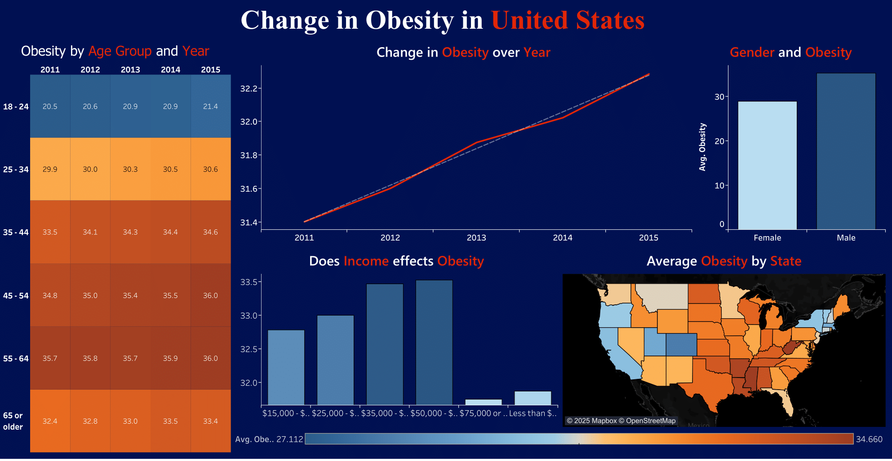

# 📄 COVID-19 Public Health Indicators Dashboard Report

## 👤 Author
**Obai Ahmed**  
📧 obai.ahmed@email.com  
🔗 [LinkedIn](https://www.linkedin.com/in/obai-ahmed-b7697433a/)  
🔗 [GitHub](https://github.com/SoObai)

## 📝 Abstract
This Tableau dashboard project analyzes COVID-19-era public health trends across U.S. states, using CDC's Nutrition, Physical Activity, and Obesity (NPAO) dataset. The dashboard explores how state-level indicators changed across years, providing stakeholders a visual summary to identify patterns, hotspots, and anomalies in population health during and after the COVID-19 pandemic.

## 🎯 Objectives
- Visualize disparities in obesity and health behaviors across U.S. states.
- Identify time-based patterns and trends in physical activity and nutrition.
- Enable dynamic exploration of CDC health indicators using Tableau.
- Present findings in an interactive and intuitive dashboard format.

## 📸 Dashboard Preview
Below is a sample preview of the dashboard (replace with your actual screenshot):



> 📌 *Replace `dashboard_preview.png` with a screenshot of your actual Tableau dashboard for better impact.*

## 📊 Dataset Overview
- **Source**: U.S. Centers for Disease Control and Prevention (CDC)
- **Dataset**: `cdc_npao.csv`
- **Variables**:
  - State
  - Year
  - Health Indicator (e.g., Obesity Rate, Inactivity, Nutrition)
  - Data Value
  - Demographics (where applicable)

## 🧰 Tools Used
| Tool         | Purpose                        |
|--------------|--------------------------------|
| Tableau      | Data visualization & dashboard |
| CSV          | Raw data storage               |
| GitHub       | Project hosting & collaboration |

## 📈 Key Features of the Dashboard
1. **Interactive Geographic Heatmap**
2. **Time Series Graph**
3. **Drop-down Filters**
4. **Hover Tooltips**
5. **Responsive Layout**

## 🔍 Key Findings
- Southern states report higher obesity and inactivity rates.
- Positive trends in physical activity post-2020.
- Nutrition behaviors show improvement in several states.

## 🗂️ Folder Structure
```
📁 tableau-covid-dashboard/
├── Tableau Workbook.twbx
├── dashboard_preview.png
├── README.md
└── report.md
```

## 🚀 How to Run
1. Clone or download this GitHub repository.
2. Open `Tableau Workbook.twbx` in Tableau Desktop.
3. Explore interactive charts using dropdowns and filters.
4. Hover on visualizations to view detailed tooltips.
5. Replace `dashboard_preview.png` with your actual dashboard screenshot.

## 📚 Future Improvements
- Update with data post-2022.
- Add demographic segmentation.
- Publish to Tableau Public.
- Add predictive analytics using Tableau Calculated Fields.

## 🧾 License
This project is shared under the MIT License for educational and research purposes only.

## 🙋‍♂️ Contact
📧 obai.ahmed@email.com  
🔗 [GitHub](https://github.com/SoObai)  
🔗 [LinkedIn](https://www.linkedin.com/in/obai-ahmed-b7697433a/)
